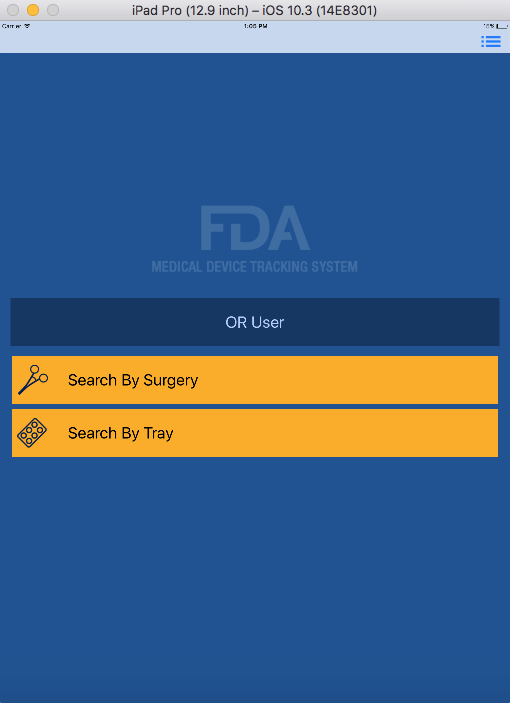
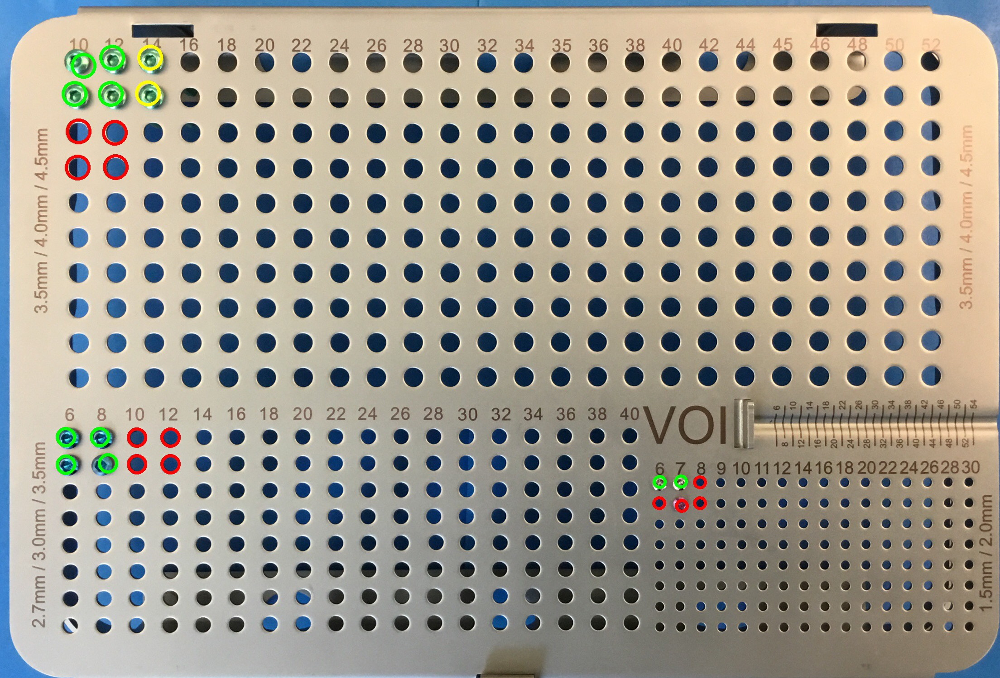
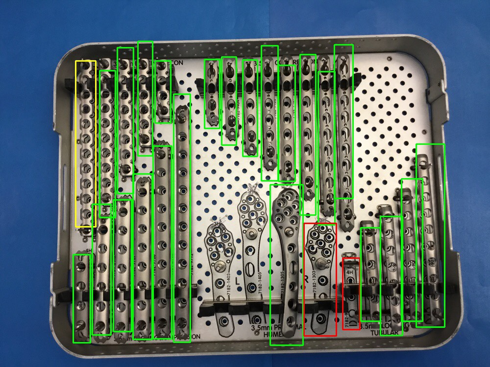

# Image Recognition of Medical Devices (IRMD)

### Overview

The FDA's Center for Devices and Radiological Health (CDRH) in collaboration with the FDA Innovation Lab has created a prototype of a possible solution to technological challenges in bringing Unique Device Identification (UDI) to the point-of-use for non-sterile implant devices. UDI is a numerical system formulated to adequately identify and track the distribution and use of medical devices. It is intended to allow healthcare professionals to identify and keep track of devices, before, during, and after their use/implantation. Full UDI adoption will improve the accuracy, reporting, and analysis of adverse events.

This prototype is a mobile application for iPads (and associated infrastructure) that contains two workflows. One workflow is for the surgery technician to take pictures of an implant tray before surgery and after surgery. Computer vision and machine learning techniques are applied to the images to automatically determine implant usage. The surgery technician can make corrections as needed and confirm the record. The other workflow is for medical personnel to stock the implant trays and record the UDIs by using a barcode scanner. 

### Medical Trays

The prototype was developed with two trays. The first tray holds medical screws. The second tray holds implants. Below are sample image recognition outputs. Green indicates unused implants. Red indicates used implants. Yellow are implants that weren't there before (shouldn't occur in practice).

### Setup

For setup, a variety of skillsets is required, including MySQL, Java, Spring Framework, Tomcat, Python, OpenCV, Tensorflow, Django, and Swift. This prototype can be broken up into four pieces, corresponding to the folders in this repository:
* /db - the MySQL script for creating and populating the database
* /innovationlab-imagerecognition - Java backend code
* /ImageRecognitionBackend  - Python backend code for running image recognition, computer vision code, and deep learning models
* /MDIR-iOS - iOS application code

The READMEs in each folder provide additional info.
